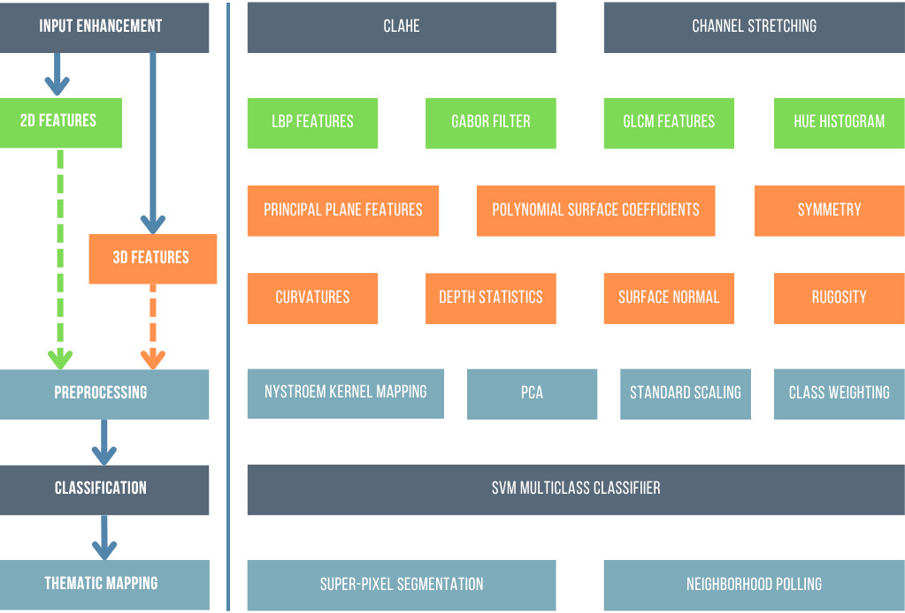

# Summary

The presence of underwater military munitions (UWMM) in coastal and marine environments poses significant environmental and safety risks. Accurate detection and classification of UWMM are critical for remediation efforts, requiring robust methods to process multi-modal data, such as optical imagery and 3D reconstructions. UWMM detection leverages computer vision, machine learning, and 3D modeling to identify munitions against complex seabed backgrounds. Existing approaches, such as those using 2D-derived image features, often suffer from high false positive rates, necessitating the integration of geometric (3D) data to improve accuracy.

`UWMM-Baseline` is an open-source Python package designed for the supervised classification of UWMMs using multi-modal data, including optical imagery (2D-derived) and digital elevation models (DEMs) derived from 3D reconstructions of the scene (3D-derived). Building on the methodology of Gleason et al. (2015) [@Gleason:2015], the package implements a modular pipeline for dataset creation, feature extraction, classification, and evaluation. Key features include:

- **Dataset Creation:** Automated tile extraction and labeling from underwater imagery and DEMs.
- **Feature Extraction:** Extraction of 2D-derived (color, texture) and 3D-derived (elevation, curvature, rugosity) features, which can be combined into a hybrid 2.5D feature set.
- **Classification:** Support for binary (UWMM vs. background) and multi-class (UWMM type) classification using Support Vector Machines (SVM).
- **Inference and Evaluation:** A complete inference pipeline to generate prediction masks on new data and quantitative evaluation using mean Intersection over Union (mIoU).
- **Modularity:** A flexible, configuration-driven framework allowing integration of new features, models, and data modalities.

`UWMM-Baseline` is designed for researchers, oceanographers, and environmental engineers working on UWMM detection, as well as educators teaching computer vision or marine science. It integrates with popular scientific Python libraries and supports workflows for both research and practical applications, such as seabed surveys and environmental monitoring.

# Statement of Need

UWMM detection is a pressing challenge in marine environments, where legacy munitions from military activities contaminate coastlines and pose risks to ecosystems and human safety. Traditional detection methods, such as acoustic or optical imagery, are often limited by resolution or seabed complexity. Optical imagery, combined with SfM-derived digital elevation models (DEMs), offers high-resolution data for precise UWMM identification, as demonstrated in [@Gleason:2015]. However, existing software tools for UWMM detection are either proprietary, domain-specific, or lack the flexibility to handle multi-modal data in a unified framework.

`UWMM-Baseline` addresses this gap by providing a free, open-source, and modular Python package that implements established UWMM classification techniques using modern libraries. Unlike general-purpose computer vision libraries, `UWMM-Baseline` is tailored for underwater environments, incorporating domain-specific preprocessing and feature extraction (e.g., rugosity, curvature from DEMs).

The package’s modularity enables researchers to experiment with new features, classifiers, or data sources (e.g., sonar, stereo vision), while its accessibility supports educational use in courses on machine learning, oceanography, or environmental science. By providing a full pipeline from data ingestion to evaluation, `UWMM-Baseline` lowers barriers to entry for UWMM detection research, fostering innovation in environmental monitoring and remediation.

# Background

The detection of UWMM in underwater environments involves processing optical imagery to identify munitions against varied seabed backgrounds (e.g., coral reefs, seagrass). The core challenge lies in distinguishing human-made objects from similarly shaped or textured natural features. It was demonstrated that while 2D-derived features (color, texture) achieve moderate accuracy (>80% for binary classification), they suffer from high false positives due to background complexity [@Gleason:2015]. Incorporating 3D-derived features (e.g., elevation, curvature) from SfM-derived DEMs significantly improves accuracy (89-95%) and reduces false positives, as these features capture the distinct geometric properties of munitions. This combined, hybrid approach is referred to as the 2.5D approach.

The methodology is broken down into a multi-stage pipeline. First, large survey images are processed into smaller, manageable tiles or tiles. This approach allows the model to learn local, high-resolution features and creates a large, diverse dataset suitable for training supervised machine learning models. The general workflow is as follows:

1.  **Dataset Creation:** Optical images, depth maps, and ground-truth masks are used to generate a labeled dataset of image tiles.
2.  **Feature Extraction:** A comprehensive set of 2D-derived and 3D-derived features is extracted from each tile.
3.  **Model Training:** A classifier, such as an SVM, is trained on the extracted features.
4.  **Inference:** The trained model is used to predict the locations of UWMM in new, unseen images.
5.  **Evaluation:** The model's predictions are compared against ground-truth data to assess performance quantitatively.

This project implements this entire workflow in a configurable and automated pipeline, building on the foundational work of Gleason et al. to provide an accessible software tool.

# Methodology

The `UWMM-Baseline` pipeline processes underwater images, depth maps, and masks to generate a labeled dataset of uniformly sized tiles for training and testing. It identifies potential UWMM and background locations using masks, extracting corresponding square tiles from image and depth data. To address class imbalance, a fixed number of background tiles are sampled per image, and only a subset of available UWMM pixels are used as tile centers. Data augmentation is applied by rotating UWMM tiles at multiple angles.

From the processed tiles, 2D-derived and 3D-derived features are extracted, extending the feature set proposed in [@Gleason:2015]:

-   **2D-derived Features (from optical images):**
    -   **Color Histograms:** HSV color distributions to capture seabed and UWMM appearance.
    -   **Local Binary Patterns (LBP):** Texture descriptors robust to illumination changes [@lbp_algorithm].
    -   **Gray Level Co-occurrence Matrix (GLCM):** Texture metrics (e.g., contrast, dissimilarity) for seabed characterization [@glcm_algorithm].
    -   **Gabor Filters:** Edge and texture detection across multiple scales and orientations [@gabor_algorithm].

-   **3D-derived Features (from depth maps):**
    -   **Principal Plane Features:** Statistics of depth values, polynomial coefficients from a fitted surface, and rugosity (ratio of surface area to planar area).
    -   **Curvatures and Normals:** Mean and Gaussian curvatures, shape index, curvedness, and surface normal vector statistics.
    -   **Symmetry Features:** Gabor filters applied to depth maps to capture structural symmetry.

The classifier is implemented using a Support Vector Machine (SVM) with a radial basis function (RBF) kernel, approximated via the Nystroem method [@svm_algorithm], [@nystroem_algorithm]. The model supports training on 2D-derived, 3D-derived, or combined 2.5D feature sets. Prior to inference, superpixel segmentation identifies homogeneous regions in the input image [@superpixel_algorithm]. These regions are subdivided into overlapping tiles, each processed by the trained model to predict class labels. A neighborhood poll determines UWMM presence by evaluating whether the number of positive tile predictions within a region exceeds a predefined threshold. The final output is a segmentation mask indicating detected UWMM locations (see \autoref{fig:inference}).

This implementation leverages standard Python libraries, including NumPy [@numpy_library], OpenCV [@opencv_library], scikit-learn [@scikit-learn_library], scikit-image [@scikit-image_library], and SciPy [@scipy_library] for feature extraction, model training, and data processing.

## Model Training and 3D-derived Feature Extraction

The classification pipeline in `UWMM-Baseline` relies on feature extraction and Support Vector Machine (SVM) classification. For a tile $\mathbf{x} \in \mathbb{R}^{m \times n}$ (image) and corresponding DEM $\mathbf{d} \in \mathbb{R}^{m \times n}$, the feature vector $\mathbf{f}_{2.5D}$ combines 2D-derived and 3D-derived features:

$$\mathbf{f}_{2.5D} = [\mathbf{f}_{2D}, \mathbf{f}_{3D}]$$

The 3D-derived features, $\mathbf{f}_{3D}$, are extracted from the elevation map of each tile. This process involves several calculations to describe the geometry of the surface.

A 2D-derived polynomial surface of the third degree is fitted to the elevation map of a tile to model its shape [@Shihavuddin:2014]. The equation for this surface is:

$$f(x,y) = p_{1}+p_{2}x+p_{3}y+p_{4}x^{2}+p_{5}xy+p_{6}y^{2}+p_{7}x^{2}y+p_{8}xy^{2}+p_{9}y^{3}$$

The nine coefficients of this polynomial ($p_1, ..., p_9$) are extracted through least-squares fitting and used as features [@Shihavuddin:2014].

Additional statistical features are calculated from the elevation values ($z_i$) within a tile, including the standard deviation, skewness, and kurtosis [@Shihavuddin:2014]. With $z_m$ as the mean elevation, $S$ as the standard deviation, and $N$ as the number of data points, the skewness and kurtosis are calculated as:

$$\text{Skewness} = \frac{\sum(z_i-z_m)^3}{(N-1)S^3}$$

$$\text{Kurtosis} = \frac{\sum_{i=1}^{N}(z_{i}-z_{m})^{4}}{(N-1)S^{4}}$$

With regards to surface curvature, the Gaussian ($G$) and mean ($M$) surface curvatures are first calculated from the partial derivatives of the elevation map where the two principal curvatures, $k_1$ and $k_2$, can then be derived [@Shihavuddin:2014]:

$$k_{1}=M+\sqrt{M^{2}-G}$$

$$k_{2}=M-\sqrt{M^{2}-G}$$

These principal curvatures are then used to calculate a shape index ($S$) and a curvedness index ($C$):

$$S=\frac{2}{\pi}\arctan\left(\frac{k_{2}+k_{1}}{k_{2}-k_{1}}\right), \quad C=\sqrt{\frac{k_{1}^{2}+k_{2}^{2}}{2}}$$

Finally, rugosity ($r$) is computed to characterize the roughness of the seafloor habitat [@Shihavuddin:2014]. It is calculated by dividing the contoured surface area of the tile ($A_s$) by the area of its orthogonal projection onto the principal plane ($A_p$):

$$r = \frac{A_s}{A_p} \quad$$

Once the full feature vector is assembled, the SVM classifier solves the following optimization problem:

$$\min_{\mathbf{w}, b, \xi} \frac{1}{2} \|\mathbf{w}\|^2 + C \sum_{i=1}^N \xi_i$$

subject to:

$$y_i (\mathbf{w}^T \phi(\mathbf{f}_i) + b) \geq 1 - \xi_i, \quad \xi_i \geq 0, \quad i = 1, \ldots, N$$

where $\mathbf{w}$ is the weight vector, $b$ is the bias, $\xi_i$ are slack variables, $C$ is the regularization parameter, $\phi$ is the kernel mapping (RBF), and $y_i$ are the class labels [@svm_algorithm].

# Acknowledgements

We thank [Advisor/Collaborator Names] for guidance on underwater imaging and SfM techniques, and [Institution/Organization] for providing access to underwater datasets. This work was supported by [Funding Agency, Grant Number].

# References