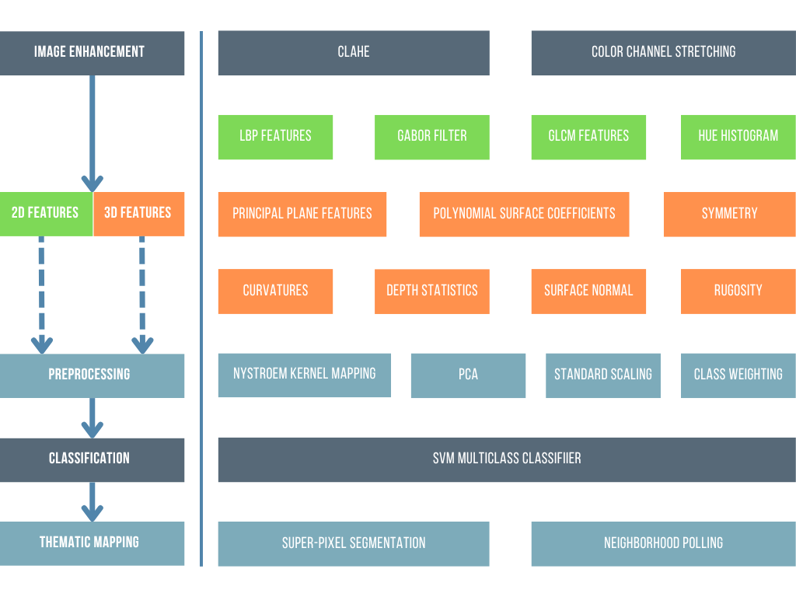

# Summary

The accurate detection and classification of objects in complex environments is a critical task across various domains, requiring robust methods to process multi-modal data, such as optical imagery and 3D reconstructions. Object detection often leverages computer vision, machine learning, and 3D modeling to distinguish targets from complex backgrounds. Existing approaches relying solely on 2D image features often suffer from high false positive rates due to background variability, necessitating the integration of 3D geometric data to enhance accuracy.

`Thematic2.5D` is an open-source Python package designed for supervised classification using multi-modal data, including optical imagery and depth-maps derived from 3D reconstructions. Building on the methodology of @Gleason:2015, the package provides a modular pipeline for dataset creation, feature extraction, classification, and evaluation. Its key features include:

- **Dataset Creation:** Automated tile extraction and labeling from imagery and depth-maps for diverse applications.
- **Feature Extraction:** Extraction of 2D-derived (color, texture) and 3D-derived (curvature, rugosity) features, which can be combined into a hybrid 2.5D feature set.
- **Classification:** Support for binary (object vs. background) and multi-class classification using Support Vector Machines (SVM).
- **Inference and Evaluation:** A complete inference pipeline to generate prediction masks on new data and quantitative evaluation using mean Intersection over Union (mIoU).
- **Modularity:** A flexible, configuration-driven framework allowing integration of new features, models, and data modalities.

`Thematic2.5D` serves as a versatile toolkit for researchers, data scientists, and educators working in computer vision, machine learning, or thematic mapping. It integrates with popular scientific Python libraries and supports workflows for both research and practical applications, such as environmental surveys, urban mapping, or industrial inspections. The package provides a classical framework to evaluate the relative contributions of 2D and 3D feature modalities, enabling users to quantify the impact of integrating geometric data with traditional image features for improved classification performance.

# Statement of Need

Object detection in complex environments is a widespread challenge across fields like environmental monitoring, urban planning, and industrial inspection, where distinguishing objects from varied backgrounds is critical. Traditional detection methods, such as those using acoustic or optical imagery, are often limited by resolution or background complexity. Optical imagery combined with depth-maps offers high-resolution data for precise object identification, as demonstrated by @Gleason:2015. However, existing software tools are often proprietary, domain-specific, or lack the flexibility to handle multi-modal data in a unified framework.

`Thematic2.5D` addresses this gap by providing a free, open-source Python toolkit that implements a classical supervised classification pipeline, inspired by @Gleason:2015, for semantic segmentation and thematic mapping. The package serves as a robust framework for evaluating the effectiveness of 2D-derived (e.g., color, texture) versus 3D-derived (e.g., curvature, rugosity) features, allowing researchers to assess the relative contributions of these modalities to classification accuracy.

Its modularity enables experimentation with new features, classifiers, or data sources (e.g., sonar, stereo vision), while its accessibility supports educational use in courses on machine learning, computer vision, or data science. By offering a comprehensive pipeline from data ingestion to evaluation, `Thematic2.5D` lowers barriers to entry for multi-modal classification research, fostering innovation across diverse applications.

# Background

Object detection in complex scenes involves processing optical imagery to identify targets against varied backgrounds (e.g., natural landscapes, urban settings). The core challenge lies in distinguishing objects from similarly shaped or textured background elements. It was demonstrated that while 2D-derived features (color, texture) achieve moderate accuracy (>80% for binary classification), they suffer from high false positives due to background complexity [@Gleason:2015]. Incorporating 3D-derived features (e.g., curvature, rugosity) from depth-maps significantly improves accuracy (89-95%) and reduces false positives by capturing distinct geometric properties. This combined, hybrid approach, referred to as the 2.5D approach, enhances classification performance by leveraging both visual and geometric information.

The `Thematic2.5D` pipeline provides a classical framework to systematically evaluate the contributions of 2D and 3D features. The methodology is broken down into a multi-stage pipeline. First, large survey images are processed into smaller, manageable tiles. This approach allows the model to learn local, high-resolution features and creates a large, diverse dataset suitable for training supervised machine learning models. The general workflow is as follows:

1.  **Dataset Creation:** Optical images, depth maps, and ground-truth masks are used to generate a labeled dataset of image tiles.
2.  **Feature Extraction:** A comprehensive set of 2D-derived and 3D-derived features is extracted from each tile.
3.  **Model Training:** A classifier, such as an SVM, is trained on the extracted features.
4.  **Inference:** The trained model is used to predict the locations of objects in new, unseen images.
5.  **Evaluation:** The model's predictions are compared against ground-truth data to assess performance quantitatively.

This project implements this entire workflow in a configurable and automated pipeline, building on the foundational work of @Gleason:2015, to provide an accessible software tool for evaluating feature modalities in supervised classification.

# Methodology

The `Thematic2.5D` pipeline processes images, depth-maps, and masks to generate a labeled dataset of uniformly sized tiles for training and testing. It identifies potential object and background locations using masks, extracting corresponding square tiles from image and depth data. To address class imbalance, a fixed number of background tiles are sampled per image, and only a subset of available object pixels are used as tile centers. Data augmentation is applied by rotating object tiles at multiple angles.

From the processed tiles, 2D-derived and 3D-derived features are extracted, extending the feature set proposed by @Shihavuddin:2014 and @Gleason:2015:

-   **2D-derived Features (from optical images):**
    -   **Color Histograms:** HSV color distributions to capture seabed and UWMM appearance [@Shihavuddin:2013].
    -   **Local Binary Patterns (LBP):** Texture descriptors robust to illumination changes [@lbp_algorithm].
    -   **Gray Level Co-occurrence Matrix (GLCM):** Texture metrics (e.g., contrast, dissimilarity) for background characterization [@glcm_algorithm].
    -   **Gabor Filters:** Edge and texture detection across multiple scales and orientations [@gabor_algorithm].

-   **3D-derived Features (from depth maps):**
    -   **Principal Plane Features:** Statistics of depth values, polynomial coefficients from a fitted surface, and rugosity (ratio of surface area to planar area).
    -   **Curvatures and Normals:** Mean and Gaussian curvatures, shape index, curvedness, and surface normal vector statistics.
    -   **Symmetry Features:** Gabor filters applied to depth maps to capture structural symmetry.

The classifier is implemented using a SVM [@svm_algorithm] with a radial basis function (RBF) kernel, approximated via the Nystroem method [@nystroem_algorithm]. The model supports training on 2D-derived, 3D-derived, or combined 2.5D feature sets. Prior to inference, superpixel segmentation [@superpixel_algorithm] identifies homogeneous regions in the input image. For each identified superpixel, a sliding window centered on its centroid is used to extract a series of overlapping tiles. These tiles are individually processed through the trained model to predict class labels. A neighborhood poll determines UWMM presence by evaluating whether the number of positive tile predictions within a region exceeds a predefined threshold. The final output is a segmentation mask indicating detected UWMM locations (see \autoref{fig:inference}).

This implementation leverages standard Python libraries, including NumPy [@numpy_library], OpenCV [@opencv_library], scikit-learn [@scikit-learn_library], scikit-image [@scikit-image_library], and SciPy [@scipy_library] for feature extraction, model training, and data processing.

## Model Training and 3D-derived Feature Extraction

The classification pipeline in `Thematic2.5D` relies on feature extraction and SVM-based classification. For a tile $\mathbf{x} \in \mathbb{R}^{m \times n}$ (image) and corresponding depth-map $\mathbf{d} \in \mathbb{R}^{m \times n}$, the feature vector $\mathbf{f}_{2.5D}$ combines 2D-derived and 3D-derived features:

$$\mathbf{f}_{2.5D} = [\mathbf{f}_{2D}, \mathbf{f}_{3D}]$$

The 3D-derived features, $\mathbf{f}_{3D}$, are extracted from the depth-map of each tile. This process involves several calculations to describe the geometry of the surface.

A 2D-derived polynomial surface of the third degree is fitted to the depth-map of a tile to model its shape [@Shihavuddin:2014]. The equation for this surface is:

$$f(x,y) = p_{1}+p_{2}x+p_{3}y+p_{4}x^{2}+p_{5}xy+p_{6}y^{2}+p_{7}x^{2}y+p_{8}xy^{2}+p_{9}y^{3}$$

The nine coefficients of this polynomial ($p_1, ..., p_9$) are extracted through least-squares fitting and used as features [@Shihavuddin:2014].

Additional statistical features are calculated from the depth values ($z_i$) within a tile, including the standard deviation, skewness, and kurtosis [@Shihavuddin:2014]. With $z_m$ as the mean depth, $S$ as the standard deviation, and $N$ as the number of data points, the skewness and kurtosis are calculated as:

$$\text{Skewness} = \frac{\sum(z_i-z_m)^3}{(N-1)S^3}$$

$$\text{Kurtosis} = \frac{\sum_{i=1}^{N}(z_{i}-z_{m})^{4}}{(N-1)S^{4}}$$

With regards to surface curvature, the Gaussian ($G$) and mean ($M$) surface curvatures are first calculated from the partial derivatives of the depth map where the two principal curvatures, $k_1$ and $k_2$, can then be derived [@Shihavuddin:2014]:

$$k_{1}=M+\sqrt{M^{2}-G}$$

$$k_{2}=M-\sqrt{M^{2}-G}$$

These principal curvatures are then used to calculate a shape index ($S$) and a curvedness index ($C$):

$$S=\frac{2}{\pi}\arctan\left(\frac{k_{2}+k_{1}}{k_{2}-k_{1}}\right), \quad C=\sqrt{\frac{k_{1}^{2}+k_{2}^{2}}{2}}$$

Finally, rugosity ($r$) is computed to characterize the roughness of the seafloor habitat [@Shihavuddin:2014]. It is calculated by dividing the contoured surface area of the tile ($A_s$) by the area of its orthogonal projection onto the principal plane ($A_p$):

$$r = \frac{A_s}{A_p} \quad$$

Once the full feature vector is assembled, the SVM classifier solves the following optimization problem:

$$\min_{\mathbf{w}, b, \xi} \frac{1}{2} \|\mathbf{w}\|^2 + C \sum_{i=1}^N \xi_i$$

subject to:

$$y_i (\mathbf{w}^T \phi(\mathbf{f}_i) + b) \geq 1 - \xi_i, \quad \xi_i \geq 0, \quad i = 1, \ldots, N$$

where $\mathbf{w}$ is the weight vector, $b$ is the bias, $\xi_i$ are slack variables, $C$ is the regularization parameter, $\phi$ is the kernel mapping (RBF), and $y_i$ are the class labels [@svm_algorithm].

# Acknowledgements

This work was supported by the SERDP project [MR23-3821](https://serdp-estcp.mil/projects/details/0fedf836-7cb0-4dea-86c0-4dd8ba82a7e2/optically-derived-3d-models-for-munitions-location-and-identification), titled "Optically Derived 3D Models for Munitions Location and Identification", funded by the DoD, DOE and EPA.

# References
